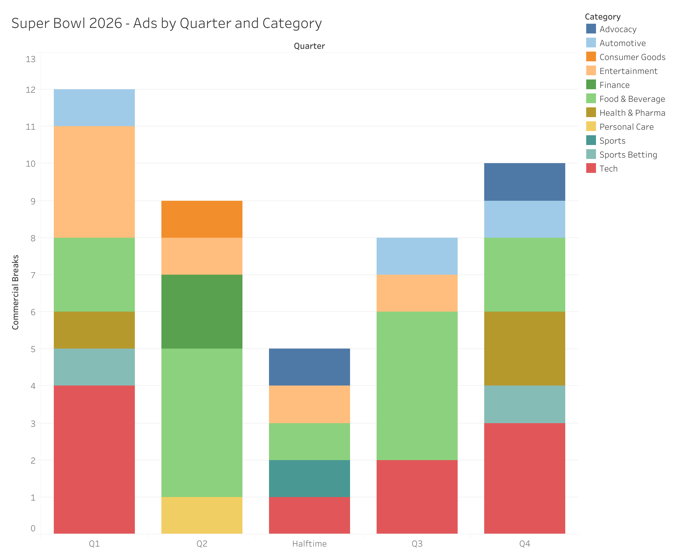

# super-bowl-ad-analysis
Super Bowl Advertising Analysis
Project Overview

This project analyzes advertising patterns during Super Bowl 2026. Commercials were categorized by industry and grouped by game segment to examine how advertising volume and category distribution vary throughout the broadcast.

The goal is to understand how brands strategically place advertisements during one of the most expensive and widely viewed television events in the world.

Business Question

How are Super Bowl commercials distributed across game segments, and which industries dominate advertising placements during the broadcast?

Dataset

The dataset contains Super Bowl 2026 commercials categorized by industry and grouped by game segment.

Game segments analyzed:

Q1

Q2

Halftime

Q3

Q4

Industry categories include:

Automotive

Consumer Goods

Entertainment

Finance

Food & Beverage

Health & Pharma

Personal Care

Sports

Sports Betting

Technology

Advocacy

Tools Used

Tableau

Excel

Data Visualization Techniques

Analytical Approach

Commercials were categorized by industry and counted within each game segment. A stacked bar visualization was created to illustrate the distribution of advertising categories across the broadcast.

This approach highlights both total ad volume per segment and the composition of industries advertising during each portion of the game.

Key Insights

The first quarter and fourth quarter contain the highest concentration of commercials.

Food & Beverage and Technology brands appear frequently across multiple game segments.

Halftime contains significantly fewer advertisements, reflecting the focus on the halftime show itself.

Advertising diversity increases in later quarters as brands target peak viewership periods.

Visualization

The chart below illustrates the distribution of commercials by industry across each game segment.

Future Improvements

Future analysis could explore advertising cost estimates and brand exposure metrics. Additional datasets could also examine viewer engagement, brand recall, or social media activity following major Super Bowl commercials.
